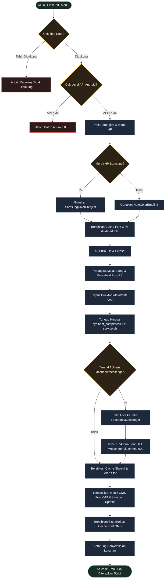

[English](README.md) | [Bahasa Indonesia](README.id.md)

# iOS Emoji

**Ganti emoji bawaan dengan emoji iOS terbaru secara global di perangkat Android.**

## Deskripsi Umum

iOS Emoji adalah modul root yang dirancang untuk memasang Emoji Apple iOS secara global pada sistem Android. Dengan menyertakan berkas font ganda (`NotoColorEmoji.ttf` dan `SamsungColorEmoji.ttf`), modul ini menjamin kompatibilitas baik pada perangkat bersistem One UI (Samsung) maupun Android standar.

---

## Mengapa Memilih iOS Emoji?

- **Kompatibilitas Luas**: Berfungsi otomatis baik di sistem Android standar maupun perangkat Samsung One UI.
- **Permanen & Stabil**: Mencegah sistem memulihkan kembali emoji bawaan secara otomatis.
- **Dukungan Aplikasi Populer**: Emoji diterapkan secara menyeluruh, termasuk di aplikasi sosial dan keyboard Anda.

---

## Persyaratan Sistem

| Persyaratan | Detail |
|-------------|--------|
| Android | 8.0+ (API 26+) |
| Aplikasi Target | Facebook, Messenger, Facebook Lite, Gboard |
| Root | Magisk v20.4+, KernelSU, atau APatch |

---

## Instalasi

1. Pasang berkas ZIP modul melalui tab **Modules** di manajer root Anda (Magisk, KernelSU, atau APatch).
2. **Reboot** (Mulai ulang) perangkat Anda untuk menerapkan emoji iOS baru secara global.

---

## Cara Kerja

---

## Pengembang & Lisensi

- **Pengembang**: [dyokism](https://github.com/dyokism)
- **Lisensi**: MIT
