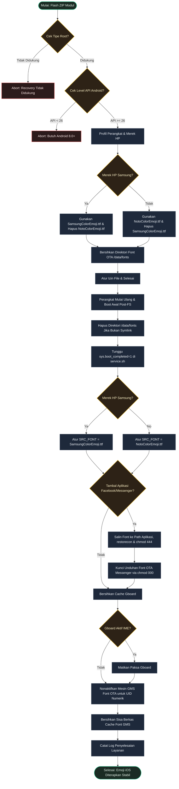

[English](file:///home/kodyy/Projects/iOS_Emoji/README.md) | [Bahasa Indonesia](file:///home/kodyy/Projects/iOS_Emoji/README.id.md)

# iOS Emoji

**Pemasangan emoji iOS secara systemless untuk Android dengan penambalan aplikasi tingkat lanjut dan optimasi ruang penyimpanan.**


## Deskripsi Umum

iOS Emoji adalah modul root komprehensif yang menggantikan emoji sistem Android secara systemless dengan gaya emoji Apple iOS terbaru. Mengusung profil merek perangkat yang dinamis, modul ini mengoptimalkan ruang penyimpanan dengan menghapus file font yang tidak terpakai, memotong pembaruan mesin Font OTA Google Play Services (GMS), serta menambal aplikasi (Facebook, Messenger, dll.) dengan penanganan SELinux yang aman.

---

## Mengapa Memilih iOS Emoji?

- **Optimasi Penyimpanan**: Mendeteksi tata letak Samsung vs AOSP saat pemasangan, menghapus file font yang tidak terpakai secara otomatis untuk menghemat ruang ~35MB.
- **Penambalan Langsung In-App**: Melompati perender emoji internal Facebook, Messenger, dan Facebook Lite dengan perizinan file yang sesuai dengan SELinux.
- **Pencegahan Pemulihan Kuat**: Menonaktifkan layanan latar belakang penyedia/pembaru font GMS untuk semua profil pengguna demi mencegah pemulihan OTA dari Google.
- **Eksekusi Fail-Safe**: Menyertakan pemeriksaan keamanan symbolic link saat boot untuk memastikan tidak ada file Custom ROM lain yang tidak sengaja terhapus.
- **Pembersihan Gboard Mulus**: Membersihkan cache emoji Gboard secara otomatis dan memulai ulang metode input hanya jika Gboard merupakan IME aktif.

---

## Persyaratan Sistem

| Persyaratan | Detail |
|-------------|--------|
| Android     | 8.0+ (API 26+) |
| Sistem      | Android Standar atau Samsung One UI |
| Root        | Magisk, KernelSU, atau APatch |

---

## Instalasi & Konfigurasi

1. Pasang berkas ZIP melalui tab **Modules** di manajer root Anda.
2. **Reboot** (Mulai ulang) perangkat Anda untuk mengaktifkan.
3. Periksa log instalasi di: `/data/adb/modules/iOS_Emoji/install.log`
4. Periksa log layanan latar belakang di: `/data/adb/modules/iOS_Emoji/service.log`

---

## Struktur Berkas

```text
iOS_Emoji/
├── META-INF/
│   └── com/
│       └── google/
│           └── android/
│               ├── update-binary
│               └── updater-script
├── system/
│   └── fonts/
│       ├── NotoColorEmoji.ttf     # font ios untuk android standar (dihapus jika samsung)
│       └── SamsungColorEmoji.ttf  # font ios untuk samsung one ui (dihapus jika non-samsung)
├── changelog.md    # catatan perubahan untuk semua versi
├── customize.sh    # pemeriksaan kompatibilitas instalasi & optimasi penyimpanan
├── module.prop     # metadata properti modul
├── post-fs-data.sh # hook awal boot untuk menghapus font OTA dengan pengaman symlink
├── service.sh      # hook akhir boot untuk penambalan aplikasi & pembersihan cache
├── uninstall.sh    # memulihkan layanan gms dan menghapus path aplikasi saat uninstall
└── update.json     # metadata pembaruan modul
```

---

## Cara Kerja


```mermaid
flowchart TD
    FlashZip([Mulai: Flash ZIP Modul]) --> CheckRoot{Cek Tipe Root?}
    CheckRoot -- Tidak Didukung --> AbortRoot[Abort: Recovery Tidak Didukung]
    CheckRoot -- Didukung --> CheckAPI{Cek Level API Android?}
    
    CheckAPI -- API < 26 --> AbortAPI[Abort: Butuh Android 8.0+]
    CheckAPI -- API >= 26 --> ProfileDevice[Profil Perangkat & Merek HP]
    
    ProfileDevice --> DetectBrand{Merek HP Samsung?}
    DetectBrand -- Ya --> SelectSamsung[Gunakan SamsungColorEmoji.ttf & Hapus NotoColorEmoji.ttf]
    DetectBrand -- Tidak --> SelectNoto[Gunakan NotoColorEmoji.ttf & Hapus SamsungColorEmoji.ttf]
    
    SelectSamsung & SelectNoto --> ClearOTAFonts[Bersihkan Direktori Font OTA /data/fonts]
    ClearOTAFonts --> SetPerms[Atur Izin File & Selesai]
    
    SetPerms --> BootStart[Perangkat Mulai Ulang & Boot Awal Post-FS]
    BootStart --> ClearOTAEarly[Hapus Direktori /data/fonts Jika Bukan Symlink]
    ClearOTAEarly --> WaitBoot[Tunggu sys.boot_completed=1 di service.sh]
    
    WaitBoot --> DetectBrandLate{Merek HP Samsung?}
    DetectBrandLate -- Ya --> SetSrcSamsung[Atur SRC_FONT = SamsungColorEmoji.ttf]
    DetectBrandLate -- No --> SetSrcNoto[Atur SRC_FONT = NotoColorEmoji.ttf]
    
    SetSrcSamsung & SetSrcNoto --> PatchFB{Tambal Aplikasi Facebook/Messenger?}
    PatchFB -- Ya --> CopyFB[Salin Font ke Path Aplikasi, restorecon & chmod 444]
    CopyFB --> BlockMessenger[Kunci Unduhan Font OTA Messenger via chmod 000]
    PatchFB -- Tidak --> ClearGboard[Bersihkan Cache Gboard]
    BlockMessenger --> ClearGboard
    
    ClearGboard --> CheckActiveIME{Gboard Aktif IME?}
    CheckActiveIME -- Ya --> KillGboard[Matikan Paksa Gboard]
    CheckActiveIME -- Tidak --> DisableGMS[Nonaktifkan Mesin GMS Font OTA untuk UID Numerik]
    KillGboard --> DisableGMS
    
    DisableGMS --> ClearGMSCache[Bersihkan Sisa Berkas Cache Font GMS]
    ClearGMSCache --> LogComplete[Catat Log Penyelesaian Layanan]
    LogComplete --> Finished([Selesai: Emoji iOS Diterapkan Stabil])

    %% Kustomisasi Tampilan dan Warna (Tema Gelap Ultra-Redup)
    classDef startEnd fill:#1b2c24,stroke:#34d399,stroke-width:1.5px,color:#e6f4ea;
    classDef fail fill:#2c1b1b,stroke:#f87171,stroke-width:1.5px,color:#fce8e6;
    classDef decision fill:#2d2216,stroke:#fbbf24,stroke-width:1.5px,color:#fef3c7;
    classDef process fill:#1e293b,stroke:#475569,stroke-width:1px,color:#f1f5f9;
    
    class FlashZip,Finished startEnd;
    class AbortRoot,AbortAPI fail;
    class CheckRoot,CheckAPI,DetectBrand,DetectBrandLate,PatchFB,CheckActiveIME decision;
    class ProfileDevice,SelectSamsung,SelectNoto,ClearOTAFonts,SetPerms,BootStart,ClearOTAEarly,WaitBoot,SetSrcSamsung,SetSrcNoto,CopyFB,BlockMessenger,ClearGboard,KillGboard,DisableGMS,ClearGMSCache,LogComplete process;
```

---

## Pengembang & Lisensi

- **Pengembang**: [dyokism](https://github.com/dyokism)
- **Lisensi**: MIT
