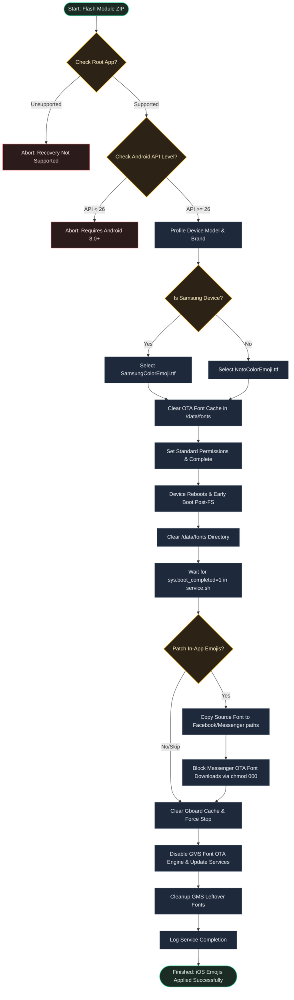

[English](README.md) | [Bahasa Indonesia](README.id.md)

# iOS Emoji

**Replace system emojis with the latest iOS Emojis on Android.**

## Overview

iOS Emoji is a root module designed to globally apply Apple iOS Emojis across Android devices. By incorporating dual-font assets (`NotoColorEmoji.ttf` and `SamsungColorEmoji.ttf`), it ensures compatibility on both One UI and stock Android emoji layouts.

---

## Why Use iOSEmoji?

- **Universal Compatibility**: Works automatically on both stock Android and Samsung One UI devices.
- **Permanent Application**: Blocks automatic system updates from reverting your custom emojis.
- **Broad App Support**: Applies emojis globally, including within popular social apps and keyboard inputs.

---

## Requirements

| Requirement | Details |
|-------------|---------|
| Android | 8.0+ (API 26+) |
| Target Apps | Facebook, Messenger, Facebook Lite, Gboard |
| Root | Magisk v20.4+, KernelSU, or APatch |

---

## Installation

1. Install the module ZIP via your root manager's **Modules** tab (Magisk, KernelSU, or APatch).
2. **Reboot** your device to apply the new iOS emoji layout globally.

---

## How It Works

---

## Developer & License

- **Developer**: [dyokism](https://github.com/dyokism)
- **License**: MIT
