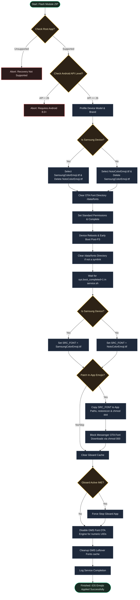

[English](README.md) | [Bahasa Indonesia](README.id.md)

# iOS Emoji

**Systemless iOS emoji overlay for Android with advanced app patching and storage optimization.**


## Overview

iOS Emoji is a comprehensive root module that systemlessly replaces system-wide Android emojis with the latest Apple iOS emoji styles. Featuring dynamic device brand profiling, it optimizes storage space by removing unused files, bypasses Google Play Services (GMS) Font OTA engine updates, and directly patches applications (Facebook, Messenger, etc.) with secure SELinux handling.

---

## Why Use iOS Emoji?

- **Storage Optimized**: Detects Samsung vs AOSP layouts at install time, automatically deleting the unused 35MB font file to save storage.
- **In-App Direct Patching**: Overrides internal emoji renderers of Facebook, Messenger, and Facebook Lite with SELinux-compliant permissions.
- **Robust Reversion Block**: Disables GMS font provider/updater background services for all user profiles to prevent Google OTA reverts.
- **Fail-Safe Execution**: Includes safety checks for symbolic links during boot, ensuring no external custom ROM files are accidentally deleted.
- **Seamless Gboard Refresh**: Automatically clears Gboard emoji caches and restarts the input method safely only if it's the active IME.

---

## Requirements

| Requirement | Details |
|-------------|---------|
| Android     | 8.0+ (API 26+) |
| System      | Stock Android or Samsung One UI |
| Root        | Magisk, KernelSU, or APatch |

---

## Installation & Configuration

1. Install the ZIP file via your root manager's **Modules** tab.
2. **Reboot** your device to activate.
3. Check installer logs at: `/data/adb/modules/iOS_Emoji/install.log`
4. Check background service logs at: `/data/adb/modules/iOS_Emoji/service.log`

---

## File Structure

```text
iOS_Emoji/
├── META-INF/
│   └── com/
│       └── google/
│           └── android/
│               ├── update-binary
│               └── updater-script
├── system/
│   └── fonts/
│       ├── NotoColorEmoji.ttf     # iOS fonts for stock android (removed if samsung)
│       └── SamsungColorEmoji.ttf  # iOS fonts for samsung one ui (removed if non-samsung)
├── changelog.md    # log of changes for all versions
├── customize.sh    # install-time compatibility checks & storage optimization
├── module.prop     # module metadata properties
├── post-fs-data.sh # early boot hook to clear OTA fonts with symlink safety
├── service.sh      # late boot hook for app patching & cache clearing
├── uninstall.sh    # restores gms services and cleans up patched paths on uninstall
└── update.json     # module update metadata
```

---

## How It Works


```mermaid
flowchart TD
    FlashZip([Start: Flash Module ZIP]) --> CheckRoot{Check Root App?}
    CheckRoot -- Unsupported --> AbortRoot[Abort: Recovery Not Supported]
    CheckRoot -- Supported --> CheckAPI{Check Android API Level?}
    
    CheckAPI -- API < 26 --> AbortAPI[Abort: Requires Android 8.0+]
    CheckAPI -- API >= 26 --> ProfileDevice[Profile Device Model & Brand]
    
    ProfileDevice --> DetectBrand{Is Samsung Device?}
    DetectBrand -- Yes --> SelectSamsung[Select SamsungColorEmoji.ttf & Delete NotoColorEmoji.ttf]
    DetectBrand -- No --> SelectNoto[Select NotoColorEmoji.ttf & Delete SamsungColorEmoji.ttf]
    
    SelectSamsung & SelectNoto --> ClearOTAFonts[Clear OTA Font Directory /data/fonts]
    ClearOTAFonts --> SetPerms[Set Standard Permissions & Complete]
    
    SetPerms --> BootStart[Device Reboots & Early Boot Post-FS]
    BootStart --> ClearOTAEarly[Clear /data/fonts Directory if not a symlink]
    ClearOTAEarly --> WaitBoot[Wait for sys.boot_completed=1 in service.sh]
    
    WaitBoot --> DetectBrandLate{Is Samsung Device?}
    DetectBrandLate -- Yes --> SetSrcSamsung[Set SRC_FONT = SamsungColorEmoji.ttf]
    DetectBrandLate -- No --> SetSrcNoto[Set SRC_FONT = NotoColorEmoji.ttf]
    
    SetSrcSamsung & SetSrcNoto --> PatchFB{Patch In-App Emojis?}
    PatchFB -- Yes --> CopyFB[Copy SRC_FONT to App Paths, restorecon & chmod 444]
    CopyFB --> BlockMessenger[Block Messenger OTA Font Downloads via chmod 000]
    PatchFB -- No/Skip --> ClearGboard[Clear Gboard Cache]
    BlockMessenger --> ClearGboard
    
    ClearGboard --> CheckActiveIME{Gboard Active IME?}
    CheckActiveIME -- Yes --> KillGboard[Force Stop Gboard App]
    CheckActiveIME -- No --> DisableGMS[Disable GMS Font OTA Engine for numeric UIDs]
    KillGboard --> DisableGMS
    
    DisableGMS --> ClearGMSCache[Cleanup GMS Leftover Fonts cache]
    ClearGMSCache --> LogComplete[Log Service Completion]
    LogComplete --> Finished([Finished: iOS Emojis Applied Successfully])

    %% Custom Styles and Colors (Ultra-Muted Slate Theme)
    classDef startEnd fill:#1b2c24,stroke:#34d399,stroke-width:1.5px,color:#e6f4ea;
    classDef fail fill:#2c1b1b,stroke:#f87171,stroke-width:1.5px,color:#fce8e6;
    classDef decision fill:#2d2216,stroke:#fbbf24,stroke-width:1.5px,color:#fef3c7;
    classDef process fill:#1e293b,stroke:#475569,stroke-width:1px,color:#f1f5f9;
    
    class FlashZip,Finished startEnd;
    class AbortRoot,AbortAPI fail;
    class CheckRoot,CheckAPI,DetectBrand,DetectBrandLate,PatchFB,CheckActiveIME decision;
    class ProfileDevice,SelectSamsung,SelectNoto,ClearOTAFonts,SetPerms,BootStart,ClearOTAEarly,WaitBoot,SetSrcSamsung,SetSrcNoto,CopyFB,BlockMessenger,ClearGboard,KillGboard,DisableGMS,ClearGMSCache,LogComplete process;
```

---

## Developer & License

- **Developer**: [dyokism](https://github.com/dyokism)
- **License**: MIT
